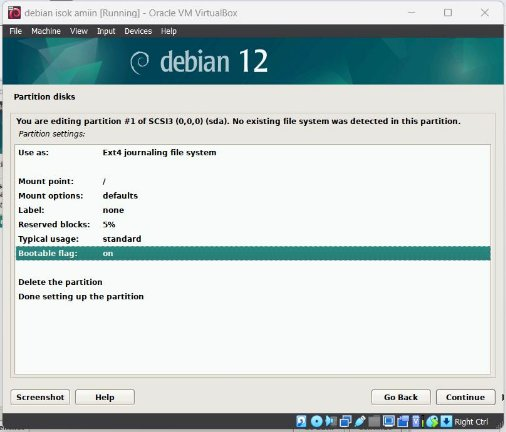
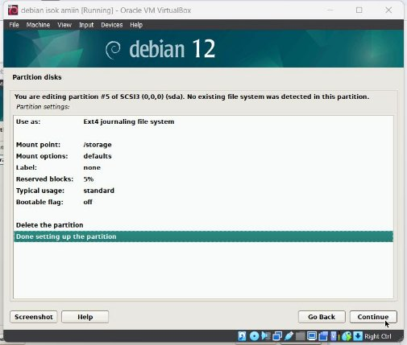
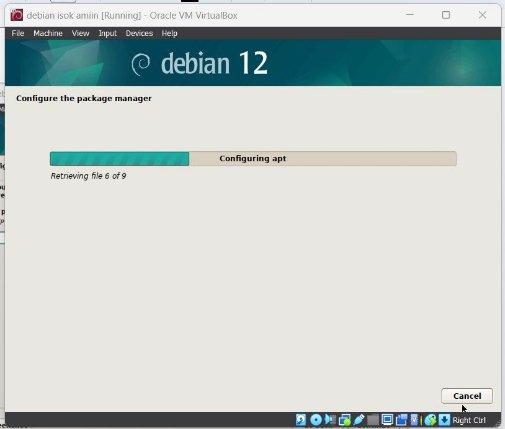

  <h1 style="text-align: center;font-weight: bold">LAPORAN WORKSHOP ADMINISTRASI JARINGAN Tugas 1</h1>
  <h4 style="text-align: center;">Dosen Pengampu : Dr. Ferry Astika Saputra, S.T., M.Sc.</h4>

 

  
  <h3 style="text-align: center;">Disusun Oleh :  Kelompok 3</h3>
  

    <strong>Mahendra Khibrah Rabbani Sayyid (3122500013)</strong> 
    <strong>Akmal Zidani Fikri (3122500019)</strong> 
    <strong>Bagus Bimo Prakoso (3122500028)</strong>
  

<h3 style="text-align: center;line-height: 1.5">Politeknik Elektronika Negeri Surabaya Departemen Teknik Informatika Dan Komputer Program Studi Teknik Informatika 2023/2024</h3>

**1.  Buatlah tulisan tentang langkah-langkah instalasi sistem operasi Debian. Anda bisa menggunakan aplikasi virtualisasi seperti VirtualBox, VMWare Player, Vmware Fusion (MAC), dls. Kebutuhan sistem adalah sebagai berikut :** 

- **CPU : 2 core** 
- **RAM : 4096 (min)** 
- **HDD : 25 GB dengan partisi :** 
- **/ : 20 GB** 
- **/storage : 5 GB** 
- **swap : 1,5 GB** 
- **Hostname : SysAdmin-NRP** 
1. Buka Virtual Machine VirtualBox, lalu klik New untuk instalasi OS Baru Debian 

2. Lalu Isikan nama Virtual Machine dan masukkan ISO OS Debian. NOTE : Check box Skip Unattended Installation agar setting OS dan partition langsung di dalam GUI OS-nya

3. Atur Base Memory, Core Processors, Size Hard Disk sesuai ketentuan 

4. Pilih Graphical Install, lalu ikuti langkah-langkah sesuai gambar dibawah 

   ini

5. Hostname sesuaikan dengan ketentuan, lalu kosongi domain, isi nama user, root, dan password sesuai keinginan

6. Partition Disk pilih yang manual untuk mengatur partisi sesuai ketentuan, dan ikuti saja langkah-langkah dibawah ini secara berurutan  

Ini merupakan hasil summary Manual Partition Disk 

7. Lanjut instalasi software dan package manager, ikuti saja langkah sesuai gambar dibawah ini 

8. Finisihing Instalasi 

9. OS sudah berhasil terinstal, selanjutnya masuk ke akun dan konfigurasi didalamnya sesuaikan dengan preferensi anda. 

10. Debian sudah siap digunakan! Enjoy.  

2. **Buat ringkasan tentang perbedaan dari Debian 12 (bookworm) dengan Debian 11 (bullseye) : versi kernel, kebutuhan sistem, penerapan systemd dan perbedaan packagenya (dalam bentuk tabel) !** 

   [Chapter 2. What's new in Debian 12 ](https://www.debian.org/releases/bookworm/amd64/release-notes/ch-whats-new.en.html)

||**Debian 11** |**Debian 12** |
| :- | - | - |
|**Kernel version** |5\.1 |6\.1 |
|**systemd** |247 |252 |
|**System requirement** |` `256 MiB RAM and 400 MHz , For workstations, diskless workstations and standalone systems, 1500 MHz and 1024 MiB RAM. combined main server + LTSP server: 60 GiB (plus additional space for user accounts). |256 MiB RAM and 400 MHz , For workstations, diskless workstations and standalone systems, 1500 MHz and 1024 MiB RAM. combined main server + LTSP server + workstation (if a GUI on the server is desired): 60 GiB |
|**Package** |Apache (2.4.54), bash (5.1), mariaDB (10.5), openJDK (11), Nginx(1.18), php (7.4), python 3 (3.9.2) |Apache (2.4.57), bash (5.2.15), mariaDB (10.11), openJDK (17), Nginx(1.22), php (8.2), python 3 (3.11.2) |

3. **Jelaskan fungsi dari file "/etc/groups" beserta formatnya!** 

   [11.7. Direktori LDAP (debian.org) ](https://www.debian.org/doc/manuals/debian-handbook/sect.ldap-directory.id.html)penjelasan 11.7.2 File yang menyimpan group yang ada di linux dan UNIX.  

**Format : group\_name:password:GID:user\_list** 

4. **Jelaskan perbedaan penggunaan perintah "su" dengan "su -"!** 

   Su dan su- adalah 2 metode berbeda yang digunakan untuk mengganti akun user.  

   Su : ketika mengganti akun, enviroment variable dari user original. 

   Su - : ketika mengganti akun, enviroment variable akan bersih. 

   [Apa Perbedaan Antara su dan su - Command di Linux? (operavps.com) ](https://operavps.com/docs/su-vs-su-dash/)

5. **Jelaskan fungsi dari "sudo" !** 

   [Bab 4. Kontrol akses dan autentikasi (debian.org) ](https://www.debian.org/doc/manuals/debian-reference/ch04.id.html#_sudo)

   [Perbedaan Sudo Dengan Su Di Linux|D3 Teknik Komputer A.Md.Kom (stekom.ac.id) ](https://teknik-komputer-d3.stekom.ac.id/informasi/baca/Perbedaan-Sudo-Dengan-Su-Di-Linux/614465e4275228898db51d3e99ec840f22fc6aa1)

   Sudo untuk sysAdmin memberikan akses root terbatas kepada user. Sudo bisa diakses user dengan memasukkan password milik user. 

   Contoh saat tidak menggunakan sudo :  

Contoh saat menggunakan sudo :  

6. **Jelaskan langkah-langkah penambahan user anda sebagai user sudo ! Gunakan perintah "su -" lalu setelah masuk sebagai root, jalankan perintah "visudo". Tambahkan user anda di bawah user root pada bagian** 

   **" # User privilege specification"** 

   Sebelum user ditambahkan dibawah root :  

Proses menambahkan user di bawah root :  

