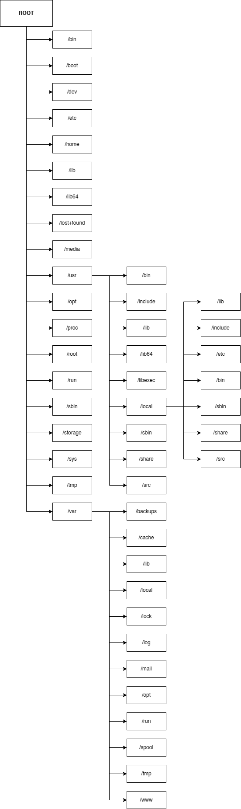

  <h1 style="text-align: center;font-weight: bold">LAPORAN WORKSHOP ADMINISTRASI JARINGAN Tugas 2</h1>
  <h4 style="text-align: center;">Dosen Pengampu : Dr. Ferry Astika Saputra, S.T., M.Sc.</h4>

 

  
  <h3 style="text-align: center;">Disusun Oleh :  Kelompok 3</h3>
  

    <strong>Mahendra Khibrah Rabbani Sayyid (3122500013)</strong> 
    <strong>Akmal Zidani Fikri (3122500019)</strong> 
    <strong>Bagus Bimo Prakoso (3122500028)</strong>
  

<h3 style="text-align: center;line-height: 1.5">Politeknik Elektronika Negeri Surabaya Departemen Teknik Informatika Dan Komputer Program Studi Teknik Informatika 2023/2024</h3>

## 1. Tulis kembali dalam bahasa Indonesia dengan gaya tulisanmu sendiri tentang standar struktur direktori dari Debian (Gunakan referensi https://www.debianadmin.com/linux-directory-structure-overview.html)! Gambarkan struktur direktori dari hasil instalasimu ! (gambar bisa menggunakan Miro, draw.io atau lainnya)

### Penulisan Struktur Direktori pada Linux

Perbedaan yang paling gampang dicermati adalah pada Formatnya. Bukan hanya formatnya saja, tapi juga logic untuk mencari direktori juga berbeda.

Format akses suatu direktori pada Windows : `D:\Folder\subfolder\file.txt`

Jika pada linux : `/Folder/subfolder/file.txt`

Pada Windows memakai backslash '\', sedangkan Linux memakai slash '/'
Pada Windows struktur direktori terdapat drive name (C:, D:, dll.), sedangkan di linux tidak terdapat drive name melainkan melalui root partition dan semua file, folder, device, dan drive berada di bawah root dan untuk mengakses kebawah root menggunakan '\'

Perlu digaris bawahi dalam Linux untuk mengarahkan ke suatu direktori huruf kapital tidaknya itu harus sesuai, karena Linux itu case-sensitive.

Contoh :
`/Folder/subfolder/file.txt` itu tidak sama dengan `/folder/subfolder/file.txt`

Jadi linux menganggap hanya dengan satu karakter huruf yang berbeda merupakan direktori yang berbeda juga karena sifatnya yang case-sensitive.

Struktur Direktori pada Unix dan Linux merupakan tergabung jadi satu Struktur direktori, dimana semua direktori terhubung menjadi satu dibawah '/' Root file system. Terlepas dimanakah file system secara fisik dipasang, semua direktori disusun secara terstruktur hierarkis dibawah Root file system.

Semua aturan hierarki tadi mengikuti acuan dari "Filesystem Hierarchy Structure (FHS) yang disusun oleh Free Standards Group, meskipun sebagian distribusi besar terkadang menyimpang dari standar

#### Root Directory (`/`)

Struktur direktori dimulai dari Root file system (`/`) yang merupakan titik awal untuk semua struktur. Ini adalah tempat di mana semua direktori terhubung.

#### `/boot`

Berisi file-file Boot Loader seperti Grub atau Lilo, Kernel, initrd, dan konfigurasi file system.map.

#### `/sys`

Berisi kernel, firmware, dan file-file yang terkait dengan sistem.

#### `/sbin`

Berisi Binary Sistem yang esensial dan alat-alat Administrasi Sistem yang penting untuk operasi dan performa sistem.

#### `/bin`

Berisi binary penting untuk pengguna dan utilitas yang diperlukan dalam mode single user. Contohnya termasuk `cat`, `ls`, `cp`, dll.

#### `/lib`

Berisi file-file pustaka yang diperlukan oleh semua binary yang berada di dalam direktori `/sbin` & `/bin`.

#### `/dev`

Berisi file sistem dan driver yang esensial.

#### `/etc`

Berisi file konfigurasi sistem yang penting seperti `/etc/hosts`, `/etc/resolv.conf`, `nsswitch.conf`, dll. Sebagian besar berisi konfigurasi host spesifik dan aplikasi.

#### `/home`

Semua direktori home pengguna berada di bawah direktori ini, kecuali direktori home root (`/root`). Direktori ini menyimpan file pengguna dan pengaturan pribadi seperti `.profile`, dll.

#### `/media`

Tempat umum untuk pemasangan media yang dapat dilepas seperti CD-ROM, USB, Floppy disk, dll.

#### `/mnt`

Tempat umum untuk pemasangan sistem file sementara. Biasanya digunakan saat melakukan troubleshooting dari CD-ROM atau untuk memasang sistem file root dan mengedit konfigurasi.

#### `/opt`

Direktori yang jarang digunakan untuk Paket Perangkat Lunak Opsional. Biasanya digunakan di sistem UNIX seperti Sun Solaris di mana paket perangkat lunak terinstal.

#### `/usr`

Sub-hierarki dari file sistem root yang berisi data pengguna. Berisi utilitas dan aplikasi pengguna yang spesifik. Ini termasuk direktori `bin`, `sbin`, dan `lib` yang berisi binary sistem dan pustaka yang terkait.

- `/usr/sbin`: Berisi binary sistem non-esensial dan non-kritis serta utilitas jaringan.
- `/usr/bin`: Berisi binary perintah non-esensial dan non-kritis untuk pengguna.
- `/usr/lib`: Berisi pustaka untuk binary yang ada di dalam direktori `/usr/bin` dan `/usr/sbin`.
- `/usr/share`: Direktori data independen platform yang dibagi.

#### `/usr/local`

Sub-hierarki di bawah `/usr` yang berisi data sistem lokal khusus pengguna dan binary sistem serta pustakanya.

#### `/var`

Biasanya dipasang sebagai sistem file terpisah di bawah root, berisi konten variabel seperti log, file spool untuk printer, crontab, pekerjaan at, email, proses yang berjalan, file kunci, dll.

#### `/tmp`

Sistem file sementara yang akan dibersihkan saat sistem reboot. Juga terdapat direktori `/var/tmp` yang berisi file sementara, namun dengan perlindungan saat reboot.

Selain itu, terdapat sistem file virtual (/proc) yang berada di dalam memori dan dipasang di bawah root, berisi informasi kernel dan statistik proses dalam format file teks.

## 2. Buat slide dalam bahasa Indonesia dengan gaya bahasamu sendiri tentang dasar system administrasi ! Gunakan referensi buku : Debian12- SysAdmmin.pdf

### PPT Tugas [Link PPT kami](https://drive.google.com/file/d/1Fo09IzTcDx9N-X00HargtwbsyEMdwz4X/view?usp=sharing)

## 3. Tugas tambahan, Mengubah IPv4 melalui Network Manager

<h4>Mencoba kustomisasi IPv4 lewat Network Manager</h4>

Cek gateway, IP, Interface dan netmask melalui bantuan “sudo route -n” 

Diketahui gateway 10.0.2.2 dan netmask /24 atau 255.255.255.0 dan nama device interfacenya adalah enp0s3 

- Ini dalam kondisi terhubung ke internet eepiswlan. 

Ini default automatic IPv4 DHCP dan DNS automatic 

 

Masih terhubung ke internet 

Lalu coba mengganti IPv4 dan DNS secara manual 

On/Off koneksi untuk refresh perubahan IP yang telah dilakukan 

![ref1]

![ref2]

![ref1]

Setelah refresh, IPv4 dan DNS berhasil berubah 

Saat dicoba kembali dengan IP dan DNS baru, tidak dapat tersambung. 

- Sekarang coba terhubung internet hotspot pribadi. 

Dalam keaadaan default automatic 

Berhasil terhubung ke internet dengan setting IPv4 Default 

Lalu coba setting IPv4 Manual 

On/Off koneksi untuk refresh perubahan IP yang telah dilakukan 

![ref1]

![ref2]

![ref1]

Setelah refresh, IP berhasil diubah  

Berhasil terhubung setelah dilakukan perubahan IP dan DNS dengan menggunakan hotspot pribadi 

[ref1]: images/tugas2/Aspose.Words.022e2579-d343-4a48-9699-84e17aa61a6b.007.png
[ref2]: images/tugas2/Aspose.Words.022e2579-d343-4a48-9699-84e17aa61a6b.008.png
