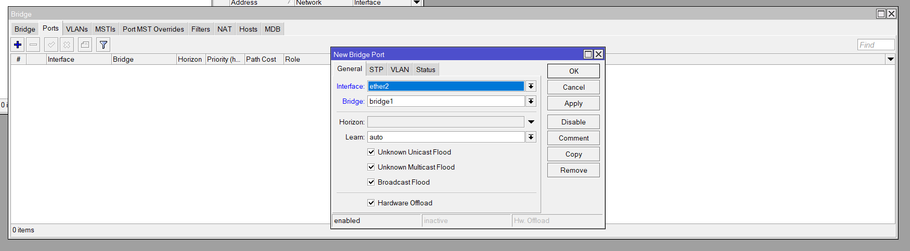
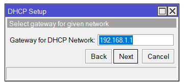

<div align="center">
  <h1 style="text-align: center;font-weight: bold">LAPORAN WORKSHOP ADMINISTRASI JARINGAN<br>Tugas 3</h1>
  <h4 style="text-align: center;">Dosen Pengampu : Dr. Ferry Astika Saputra, S.T., M.Sc.</h4>
</div>
<br />
<div align="center">
  
  <h3 style="text-align: center;">Disusun Oleh : <br>Kelompok 1</h3>
  <p style="text-align: center;">
    <strong>Mahendra Khibrah Rabbani Sayyid (3122500013)</strong><br>
    <strong>Akmal Zidani Fikri (3122500019)</strong><br>
    <strong>Bagus Bimo Prakoso (3122500028)</strong>
  </p>

<h3 style="text-align: center;line-height: 1.5">Politeknik Elektronika Negeri Surabaya<br>Departemen Teknik Informatika Dan Komputer<br>Program Studi Teknik Informatika<br>2023/2024</h3>
<hr>
<hr>
</div>

## 1. Mencoba Install Package Eksternal - GDebi - DPKG

Intstall gdebi menggunakan apt
<br>


<<<<<<< HEAD
<br>
=======
>>>>>>> 514780db24742ef16a58804b06e09fd7ffdd7fb5

Pilih package .deb lalu pilih untuk install melalui gdebi
<br>


<<<<<<< HEAD
<br>
=======


>>>>>>> 514780db24742ef16a58804b06e09fd7ffdd7fb5

Pada tampilan gdebi klik untuk install package
<br>


<<<<<<< HEAD
<br>
=======
>>>>>>> 514780db24742ef16a58804b06e09fd7ffdd7fb5

Sebelum install, kita akan dimintai untuk memasukkan password user
<br>


<<<<<<< HEAD
<br>

Berikut adalah proses instalasi dari .deb file
<br>


<br>
=======

Berikut adalah proses instalasi dari .deb file
>>>>>>> 514780db24742ef16a58804b06e09fd7ffdd7fb5

Kita bisa menghapus package dengan menekan menu dari remove package
<br>


<<<<<<< HEAD
<br>
=======


>>>>>>> 514780db24742ef16a58804b06e09fd7ffdd7fb5

**DPKG**
<br>

Install deb file menggunakan dpkg di cli
<br>


<<<<<<< HEAD
<br>
=======
>>>>>>> 514780db24742ef16a58804b06e09fd7ffdd7fb5

Jika terdapat error maka install satu per satu dependency yang diperlukan menggunakan apt
<br>

Untuk menghapus package deb bisa menggunakan command
`dpkg –purge nama_package`
<br>

<br>

<<<<<<< HEAD
## 2. Setting Mikrotik Lab Jaringan PENS
=======
Buka WinBox dan pastikan terhubung dengan LAN Mikrotik. 
Menghubungkan MAC Address Mikrotik dengan mode Legacy.
>>>>>>> 514780db24742ef16a58804b06e09fd7ffdd7fb5

### Topologi


<<<<<<< HEAD
Buka WinBox dan pastikan terhubung dengan LAN Mikrotik.
Menghubungkan MAC Address Mikrotik dengan mode Legacy.
<br>
=======

>>>>>>> 514780db24742ef16a58804b06e09fd7ffdd7fb5


<<<<<<< HEAD
<br>
Set IP Address baru untuk ethernet 1 dengan masuk ke menu IP Address.
<br>
=======

>>>>>>> 514780db24742ef16a58804b06e09fd7ffdd7fb5


IP Baru berhasil ditambahkan
<br>


Set Bridge
<br>

<<<<<<< HEAD

=======

>>>>>>> 514780db24742ef16a58804b06e09fd7ffdd7fb5

Buat bridge baru
<br>

<<<<<<< HEAD

=======

>>>>>>> 514780db24742ef16a58804b06e09fd7ffdd7fb5

Bridge berhasil ditambahkan.
<br>

<<<<<<< HEAD

<br>
Pindah ke tab submnu ports untuk menambahkan port secara manual,
=======
Pindah ke tab submnu ports untuk menambahkan port secara manual,
>>>>>>> 514780db24742ef16a58804b06e09fd7ffdd7fb5
untuk port ether2,3,4,5 agar menjadi satu switch bridge.
<br>

<<<<<<< HEAD

<br>


<br>


<br>


<br>


<br>


<br>


<br>


<br>
=======


>>>>>>> 514780db24742ef16a58804b06e09fd7ffdd7fb5

Setelah set bridge dan menyatukan port ether2,3,4,5 menjadi satu switch,
selanjutnya tambahkan ip address untuk port yang jadi satu tadi.
<br>


<br>

<<<<<<< HEAD

<br>


<br>
=======


>>>>>>> 514780db24742ef16a58804b06e09fd7ffdd7fb5

Setelah itu set route, agar bisa tersambung ke gateway
<br>

<<<<<<< HEAD

=======

>>>>>>> 514780db24742ef16a58804b06e09fd7ffdd7fb5

<br>
Ini default setelah set IP pada step sebelumnya
<br>

<<<<<<< HEAD

<br>


=======


>>>>>>> 514780db24742ef16a58804b06e09fd7ffdd7fb5

Route ke gateway berhasil ditambahkan
<br>

<<<<<<< HEAD

<br>
=======

>>>>>>> 514780db24742ef16a58804b06e09fd7ffdd7fb5

Selanjutnya set DHCP, agar setiap device yang connect mendapatkan IP secara otomatis atau dinamis.
<br>

<<<<<<< HEAD

<br>


<br>
=======


>>>>>>> 514780db24742ef16a58804b06e09fd7ffdd7fb5

Masuk DHCP Setup, lalu pilih interface Bridge1 yaitu bridge yang sudah kita setup pada step sebelumnya.
<br>

<<<<<<< HEAD

<br>


<br>


<br>


<br>


<br>
=======

>>>>>>> 514780db24742ef16a58804b06e09fd7ffdd7fb5

Disini kami coba set IP yang akan diberikan mulai dari .200 - .254
<br>

<<<<<<< HEAD

<br>


<br>


<br>
=======


>>>>>>> 514780db24742ef16a58804b06e09fd7ffdd7fb5

Setup DHCP berhasil ditambahkan
<br>

<<<<<<< HEAD

<br>


<br>
=======


>>>>>>> 514780db24742ef16a58804b06e09fd7ffdd7fb5

Koneksi sudah tersambung, tetapi belum bisa mengakses internet
<br>

<<<<<<< HEAD

<br>


<br>


<br>
=======


>>>>>>> 514780db24742ef16a58804b06e09fd7ffdd7fb5

Step terakhir agar bisa tersambung ke akses internet yaitu dengan set Firewall
<br>

<<<<<<< HEAD

<br>
=======

>>>>>>> 514780db24742ef16a58804b06e09fd7ffdd7fb5

Masuk ke tab submenu NAT
<br>

<<<<<<< HEAD

<br>

Tambahkan rule NAT baru untuk Network bridge kita ke semua destination network
<br>


<br>

Lalu masuk ke tab submenu Action dan ubah action menjadi masquerade.
<br>


<br>
=======


Tambahkan rule NAT baru untuk Network bridge kita ke semua destination network

Lalu masuk ke tab submenu Action dan ubah action menjadi masquerade.
>>>>>>> 514780db24742ef16a58804b06e09fd7ffdd7fb5

Berhasil ditambahkan rule NAT.
<br>

<<<<<<< HEAD

<br>
=======


>>>>>>> 514780db24742ef16a58804b06e09fd7ffdd7fb5

Kita coba kembali tes apakah sudah terkoneksi ke akses internet
<br>

<<<<<<< HEAD

<br>
=======


>>>>>>> 514780db24742ef16a58804b06e09fd7ffdd7fb5

Berhasil terkoneksi
<br>

<<<<<<< HEAD

<br>
=======

>>>>>>> 514780db24742ef16a58804b06e09fd7ffdd7fb5


<br>

SELESAI

```

```
