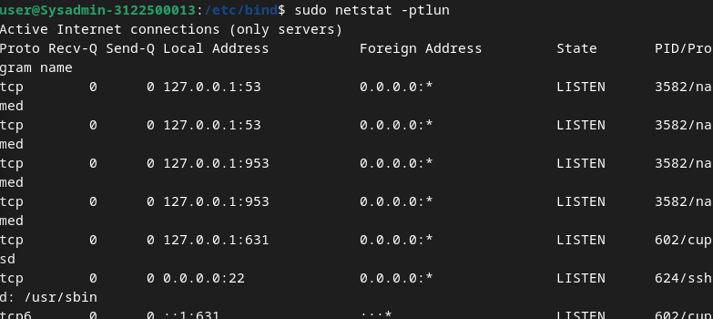

  <h1 style="text-align: center;font-weight: bold">LAPORAN WORKSHOP ADMINISTRASI JARINGAN Tugas 4</h1>
  <h4 style="text-align: center;">Dosen Pengampu : Dr. Ferry Astika Saputra, S.T., M.Sc.</h4>

 

  
  <h3 style="text-align: center;">Disusun Oleh :  Kelompok 1</h3>
  

    <strong>Mahendra Khibrah Rabbani Sayyid (3122500013)</strong> 
    <strong>Akmal Zidani Fikri (3122500019)</strong> 
    <strong>Bagus Bimo Prakoso (3122500028)</strong>
  

<h3 style="text-align: center;line-height: 1.5">Politeknik Elektronika Negeri Surabaya Departemen Teknik Informatika Dan Komputer Program Studi Teknik Informatika 2023/2024</h3>

## 1. Tugas Baca tentang Ekosistem Internet (Materi sudah diunggah di Ethol). Tuliskan pendapatmu tentang bagaimana Internet bekerja (tugas pribadi)!

Menurut saya, internet adalah  ekosistem berkelanjutan di mana berbagai entitas seperti penyedia konten, titik pertukaran Internet, dan gTLD/ccTLD (domain tingkat atas kode negara dan global) bekerja sama untuk mengoptimalkan perutean dan pengiriman konten.
 Pendidikan dan pengembangan juga merupakan aspek penting dalam memahami cara kerja Internet.
 Secara teknis, Internet diawali dengan proses penetapan domain oleh ICANN (Internet Corporation for Assigned Names and Numbers).
 Proses ini dilakukan untuk domain berekstensi .id melalui perusahaan seperti PANDI di Indonesia.
 Administrator DNS kemudian memetakan lokasi nama ke alamat IP.
 Misalnya, ketika komputer menggunakan nama host, nama tersebut diterjemahkan ke alamat IP melalui router.
 Sistem perutean memastikan bahwa informasi mencapai tujuannya melalui serangkaian router, masing-masing router memiliki alamat IP.
 Ada dua jenis alamat IP: IPv4 dan IPv6.
 Perutean juga mencakup konfigurasi kebijakan router dan protokol perutean.
 Komunikasi antar ISP (Penyedia Layanan Internet) melibatkan koneksi peering yang menerapkan kebijakan penyedia-pelanggan, transit, dan pembayaran gratis.
 Hal ini memengaruhi cara data ditransfer antar penyedia layanan dengan tujuan meminimalkan latensi dan memaksimalkan efisiensi.
 Penyedia konten, seperti  penyedia layanan seperti Google dan YouTube, memiliki kebijakan peruteannya sendiri.
 Mereka menggunakan strategi seperti caching untuk mempercepat akses ke konten dan meningkatkan kepuasan pengguna.
 Sistem penamaan seperti DNS (Domain Name System) memungkinkan pengguna  mengakses situs web menggunakan nama domain, bukan alamat IP.
 Ini adalah hierarki server DNS dan komponen seperti namespace, server nama, dan penyelesai.
 Selain itu, organisasi standar  seperti Internet Engineering Task Force (IETF) bertanggung jawab atas standardisasi teknis dalam pengembangan Internet, yang mencakup protokol untuk transport lapisan 3  dan protokol lainnya.
 Secara keseluruhan, Internet beroperasi sebagai ekosistem yang kompleks di mana berbagai entitas dan protokol bekerja sama untuk menyediakan konektivitas dan konten kepada pengguna.

## 2. Bagaimana Cara kerja dari iterative dan recursive dari DNS Query, ada 8 step, dari PC anda!

### Misal dari BBC.com

**1. Pengguna mengetikkan alamat \"bbc.com\" di browser.**

**2. Browser mengirimkan permintaan DNS ke resolver DNS lokal yang
terhubung ke internet.**

**3. Resolver DNS lokal tidak memiliki informasi alamat IP untuk
\"bbc.com\", sehingga memulai proses pencarian.**

**4. Pencarian Iteratif:**

- Resolver DNS lokal bertanya kepada salah satu dari 13 root server
  global.

- Root server memberikan informasi tentang server TLD (Top-Level
  Domain) yang bertanggung jawab atas \".com\".

**5. Pencarian Rekursif:**

- Resolver DNS lokal kemudian bertanya kepada server TLD \".com\".

- Server TLD \".com\" memberikan informasi tentang server DNS yang
  memiliki informasi tentang \"bbc.com\".

- Resolver DNS lokal kemudian bertanya kepada server DNS yang
  disediakan oleh registrar domain bbc.com.

**6. Server DNS bbc.com memberikan alamat IP untuk bbc.com.**

**7. Resolver DNS lokal menerima alamat IP dari server DNS bbc.com.**

**8. Resolver DNS lokal meneruskan alamat IP ke browser.**

**Penjelasan Singkat:**

- **Resolver DNS lokal:** Perantara yang menerjemahkan nama domain
  seperti \"bbc.com\" ke alamat IP.

- **Root server:** Server yang menyimpan informasi tentang server TLD.

- **Server TLD:** Server yang bertanggung jawab atas domain tingkat
  atas seperti \".com\".

- **Server DNS registrar:** Server yang menyimpan informasi tentang
  nama domain dan alamat IPnya.

**Sumber:** <https://www.cloudflare.com/learning/dns/what-is-dns/>

## Analogi Pencarian Alamat Situs Web

**Analogi:**

Proses mencari alamat situs web bbc.com bisa dibandingkan dengan mencari alamat rumah seseorang di sebuah kota yang belum pernah dikunjungi sebelumnya.

**Langkah-langkahnya sebagai berikut:**

**1. Permintaan Awal:**

- Inginkan kunjungi rumah seorang teman di kota yang tak dikenal.

- Hanya punya nama teman (bbc.com) tanpa tahu alamatnya (alamat IP).

**2. Pertanyaan Pertama:**

- Tanyakan kepada penduduk kota.

- Mereka tidak tahu alamat teman, tapi arahkan ke pusat informasi kota
  (root server) untuk info lebih lanjut.

**3. Pusat Informasi Kota (Root Server):**

- Di sana, petugas arahkan ke wilayah yang relevan (TLD server).

**4. Wilayah (TLD Server):**

- Pergi ke wilayah sesuai petunjuk.

- Tanyakan penduduk di sana.

- Mereka arahkan ke institusi terkait (DNS server yang mengelola
  domain \".com\").

**5. Kantor Polisi (DNS Server .com):**

- Di sana, diberitahu untuk langsung tanyakan keluarga teman (DNS
  server bbc.com).

**6. Rumah Teman (DNS Server bbc.com):**

- Di sana, anggota keluarga berikan alamat lengkap teman.

**7. Kembali ke Anda:**

- Kembali dengan alamat lengkap yang diberikan oleh keluarga teman.

**8. Tiba di Rumah Teman:**

- Kunjungi teman dengan alamat yang diperoleh dan tiba di rumahnya.

## 3. Ikuti langkah-langkah instalasi DNS server dengan menggunakan aplikasi BIND9 pada Debian 12 anda [BIND9-debian-wiki](https://wiki.debian.org/Bind9#Debian_Bookworm)

Proses intalasi paket yang diperlukan

`Bind9` → paket utama untuk menyediakan dns server

`Bind9-doc` → paket yang berisikan dokumentasi mengenai bind9

`Bind9-dnsutils` → paket yang berisikan utils untuk mengelola bind9 salah
satunya `nslookup`

Konfigurasi utama bind9 yang ada di `/etc/bind`

Acl internals {} untuk memberikan akses kontrol pada dns server secara
internal pada ip tertentu.

Controls {} digunakan untuk memberikan akses pada ip dan port tertentu
untuk mengakses dns dari eksternal

Didalam konfigurasi utama, memanggil juga konfigurasi lainnya yaitu
options local dan default zone

Pada konfigurasi options mengatur izin seperti allow query dan
recursion. Pada kasus ini izin diberikan kepada internals yang ada di
named.conf sebelumnya.

Untuk listen-on untuk mengatur mana koneksi alamat ip yang didengar

Pada file konfigurasi conf.local mengatur zone file yang kita simpan.

Contoh pada gambar adalah mengatur zone file `kelompok1.local` sebagai
domain name yang ada pada file di ` /var/lib/bind/db.``kelompok1.local `,
begitu juga alamat ip terbalik.

Cek apakah konfigurasi ada error atau tidak, jika tidak ada maka error
tidak ditemukan

Pada /var/lib/bind buat file db sesuai yang sudah ada di konfigurasi
zone file sebelumnya. Contoh diatas adalah db.`kelompok1.local`

Ini adalah isi dari file `kelompok1.local`

Menyimpan serial dimana best practice nya adalah tahunBulanTanggalVersi

Di file ini mengambil dari host ns.`kelompok1.local`.

Untuk address nya menuju pada alamat ip `192.168.1.1`

Untuk www dan mail kita aliaskan sama untuk ns

Ini adalah isi dari file `kelompok1.local`.inv

Disini menyimpan alamat ip, pada kasus ini adalah 1 yang mengarah ke
(pointer to) ns.`kelompok1.local`.

Named-checkzone adalah utils yang digunakan untuk mengecek apakah
konfigurasi sudah benar.

Pada kasus ini domain name dicek apakah sudah benar, jika status 'OK'
artinya sudah terkonfigurasi dengan benar. Begitu pula untuk alamat ip
`192.168.1.1`

Setelah itu konfigurasi file `/etc/resolv.conf`

Ini adalah konfigurasi untuk sistem dns pada linux

Pada kasus ini ketika search `kelompok1.local` maka akan mencari ke
nameserver utama `192.168.1.1`, jika tidak merespons atau tidak ada maka
akn mencari di alamat ip cadangannya yaitu 2 baris bawahnya.

Restart konfigurasi bind9 pada named.conf, lalu lihat statusnya, jika
active artinya sudah berjalan

cek menggunakan sudo netstat -ptlun untuk
melihat apakah port dns `192.168.1.1` (53) sudah terbuka. Jika ada artinya
sudah terbuka

 

 

Menggunakan perintah `nslookup` dan dig untuk memerika apakah dns server
bisa mememberi jawaban. Pada kasus ini `kelompok1.local` memiliki ip
`192.168.1.1`
