

  <h1 style="text-align: center;font-weight: bold">LAPORAN WORKSHOP ADMINISTRASI JARINGAN Tugas 5.1 - Kirim Pesan Web Mail Server antar Kelompok</h1>
  <h4 style="text-align: center;">Dosen Pengampu : Dr. Ferry Astika Saputra, S.T., M.Sc.</h4>

 

  
  <h3 style="text-align: center;">Disusun Oleh :  Kelompok 1</h3>
  

    <strong>Mahendra Khibrah Rabbani Sayyid (3122500013)</strong> 
    <strong>Akmal Zidani Fikri (3122500019)</strong> 
    <strong>Bagus Bimo Prakoso (3122500028)</strong>
  

<h3 style="text-align: center;line-height: 1.5">Politeknik Elektronika Negeri Surabaya Departemen Teknik Informatika Dan Komputer Program Studi Teknik Informatika 2023/2024</h3>

## Pastikan tugas 5 (Setup Web Mail Server )sudah dilakukan dan berhasil untuk digunakan.

## Pada praktikum ini memerlukan sedikit penyesuaian dari konfigurasi yang telah dilakukan pada tugas 5 dengan settingan pada Mikrotik Lab Jaringan, karena kita akan mencoba mengirim pesan antar server kelompok.

Sambung kabel LAN Mikrotik lalu set NetworkSetting Debian pada Virtual Box

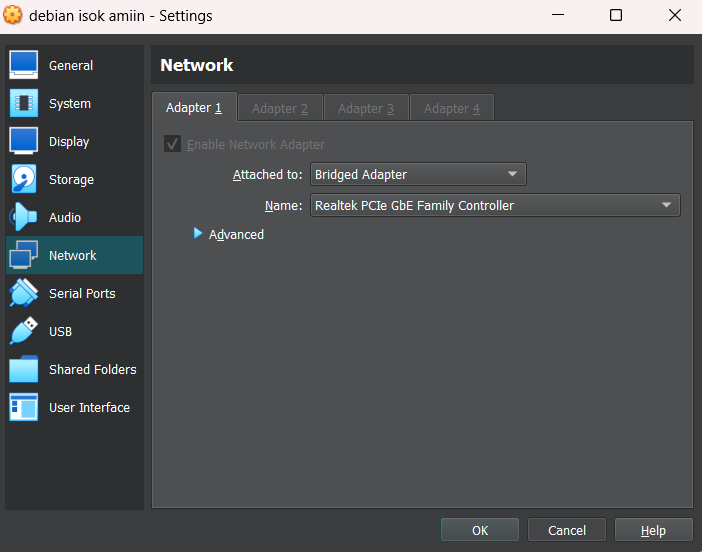  

Lalu buka winBox dan connect ke IP yang tersedia

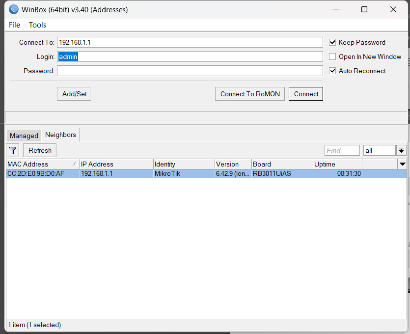  

Pada Debian set Manual IP dan DNS NetworkManager seperti dibawah ini

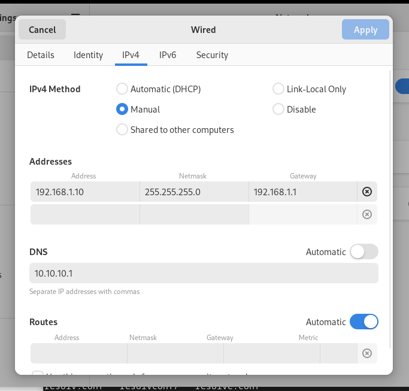  

## Lalu pastikan settingan beberapa konfigurasi seperti dibawah ini

`sudo nano /etc/bind/named.conf.options`

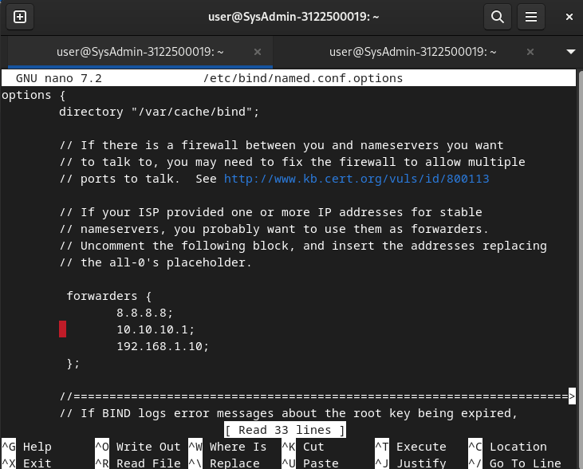  
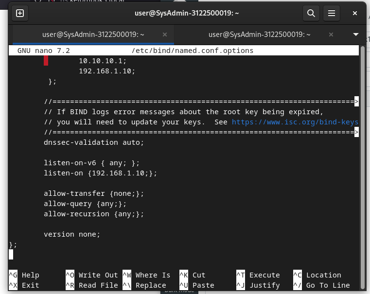  

Selanjutnya `sudo nano /etc/resolv.conf`

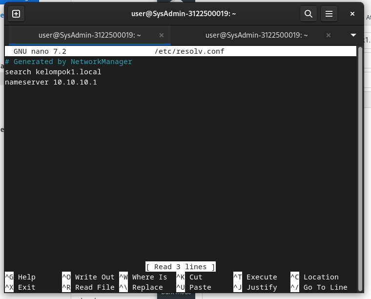  

Selanjutnya `sudo nano /var/lib/bind/db.kelompok1.local`

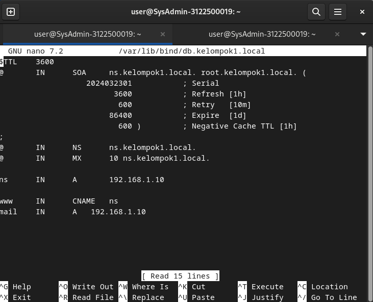  

Selanjutnya `sudo nano /etc/postfix/main.cf`

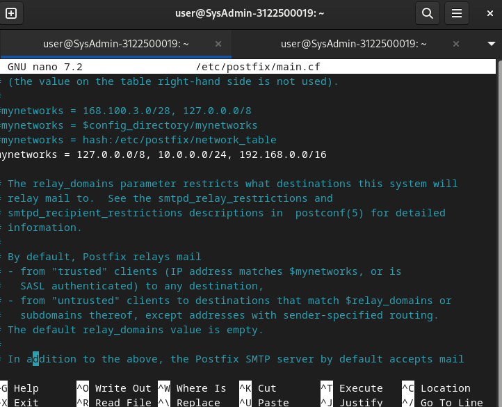  

Selanjutnya `sudo nano /etc/roundcube/config.inc.php`

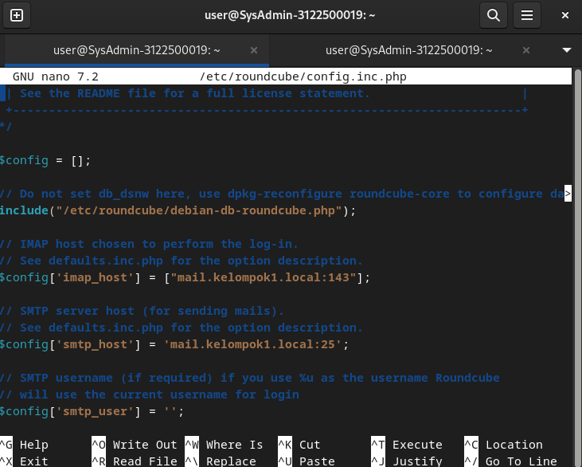  

Setelah memastikan semua konfig seperti diatas, jangan lupa restart untuk refresh

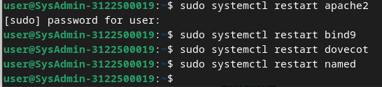  

## Menambahkan DHCP Server pada WinBox

Buka kembali winBox yang telah connect tadi, lalu buka IP > DHCP Server

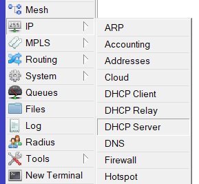  

Setelah itu hapus bridge yang telah ada, jika sudah dihapus klik DHCP Setup

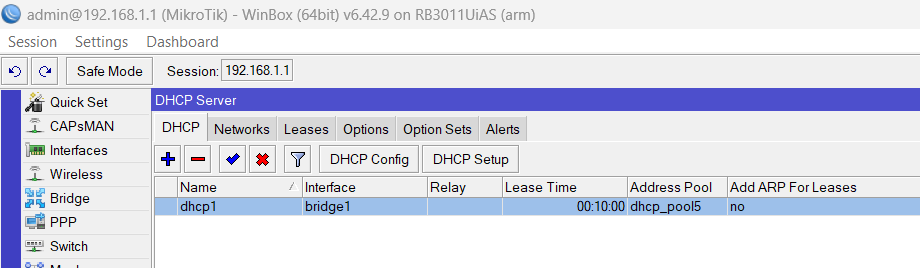  

Pada DHCP Setup pilih interface bridge1

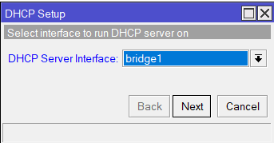  
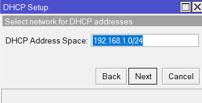  
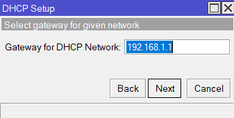  
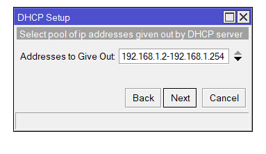  

Pada DNS Servers selain DNS kelompok, tambahkan DNS 10.10.10.1

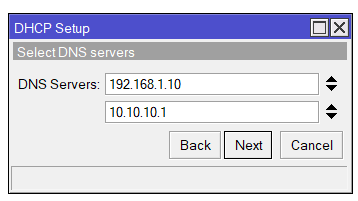  

Lalu selanjutnya next saja dengan settingan default hingga selesai

 
<h2> Mencoba mengirim pesan email ke kelompok lain </h2>

Setelah semua step diatas sudah disetup dan dikonfigurasi ulang, tes dengan login lagi melalui ThunderBird atau RoundCube sama saja.

Yang perlu diperhatikan adalah seharusnya email user sekarang menjadi `@mail.kelompok1.local`, Dimana pada konfigurasi tugas 5 sebelumnya email user adalah `@kelompok1.local`.

Note : mahen@kelompok1.local merupakan kondisi login saat melakukan percobaan kirim email dalam satu server pada tugas 5

Disini saya login menggunakan user akmal/123 pada ThunderBird
Bisa dilihat bahwa akmal@mail.kelompok1.local berhasil mengirimkan beberapa pesan ke user mail.kelompok....local kelompok lain

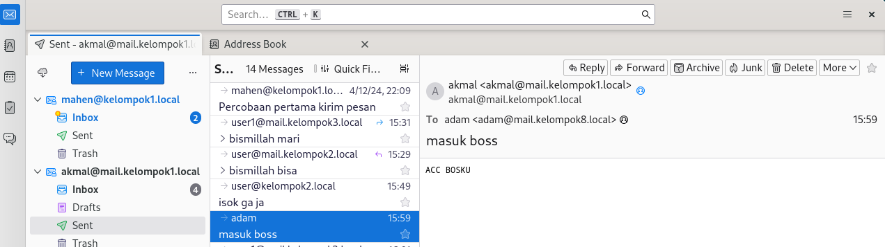  

Dan bisa dilihat juga bahwa akmal@mail.kelompok1.local berhasil menerima pesan yang dikirimkan dari kelompok lain.

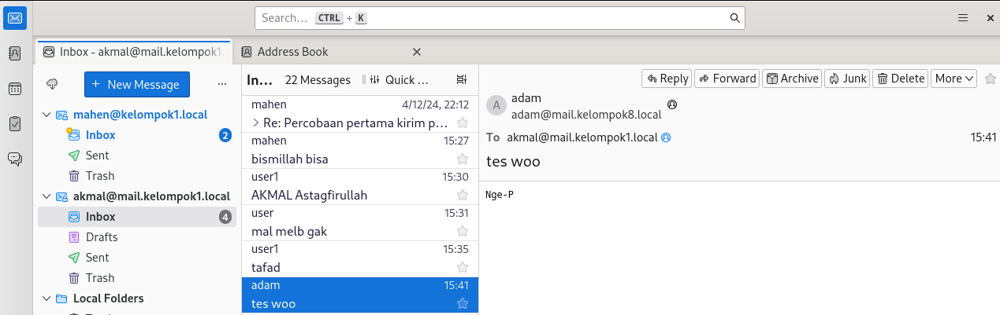  

<h1 style='text-align:center;'> -- Percobaan Berhasil -- </h1>
