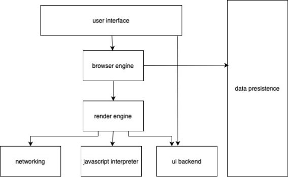
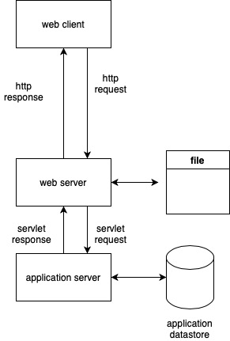



  <h1 style="text-align: center;font-weight: bold">LAPORAN WORKSHOP ADMINISTRASI JARINGAN Tugas 6 - Arsitektur web browser dan web server</h1>
  <h4 style="text-align: center;">Dosen Pengampu : Dr. Ferry Astika Saputra, S.T., M.Sc.</h4>

 

  
  <h3 style="text-align: center;">Disusun Oleh :  Kelompok 1</h3>
  

    <strong>Mahendra Khibrah Rabbani Sayyid (3122500013)</strong> 
    <strong>Akmal Zidani Fikri (3122500019)</strong> 
    <strong>Bagus Bimo Prakoso (3122500028)</strong>
  

<h3 style="text-align: center;line-height: 1.5">Politeknik Elektronika Negeri Surabaya Departemen Teknik Informatika Dan Komputer Program Studi Teknik Informatika 2023/2024</h3>

# **Web browser**

User interfaces

Tampilan dari web browser. Tampilan browser biasanya berisi halaman konten, back button, textfield untuk address bar dan fitur lainnya.

Browser engine

Browser engine bertugas untuk menghubungkan antara user interface dengan browser engine. Ketika menginputkan url di address bar, maka browser engine akan menerima dan meneruskannya ke render engine.

Render engine

Pada Chrome, render engine nya bernama Blink. Blink bertugas menampilkan konten yang diminta. Pertama tama render engine akan mengambil kode html dan mengubahnya menjadi DOM tree. Lalu render engine juga mengambil kode css dan mengubahnya menjadi CSSOM. Render engine juga mendownload asset seperti javascript file dari network layer.

Networking layer

Bertanggung jawab untuk melakukan network call untuk mengambil suatu data

Javascript engine

Pada layer ini, terdapat engine yang berguna untuk mengeksekusi kode javascript yang tersimpan pada DOM atau CSSOM. Contoh javascript engine adalah V8 Javasciprt engine, dimana engine ini digunakan pada browser Chrome.

UI Backend

Bertanggung jawab untuk mengelola tampilan seperti input boxes dan select. Selain itu layer ini juga bertanggung jawab mengelola windows.

Data Storage

Browser memiliki storage yang bisa digunakan untuk menyimpan cookies, cache, dan lain lain.

# **Web Server**

Web Server

Web server menerima http request dan mengembalikannya dalam bentuk http response. Web server biasanya akan mengembalikan file tertentu atau data dari statik database. Web server yang sering digunakan adalah Apache http server.

Application Server

Ketika web server memerlukan data processing, maka akan mengirimkan servlet request kepada application server. Application server akan melakukan pengolahan data dan memanajemen dengan menggunakan application datastore. Lalu mengembalikannya dalam bentuk servlet response.
