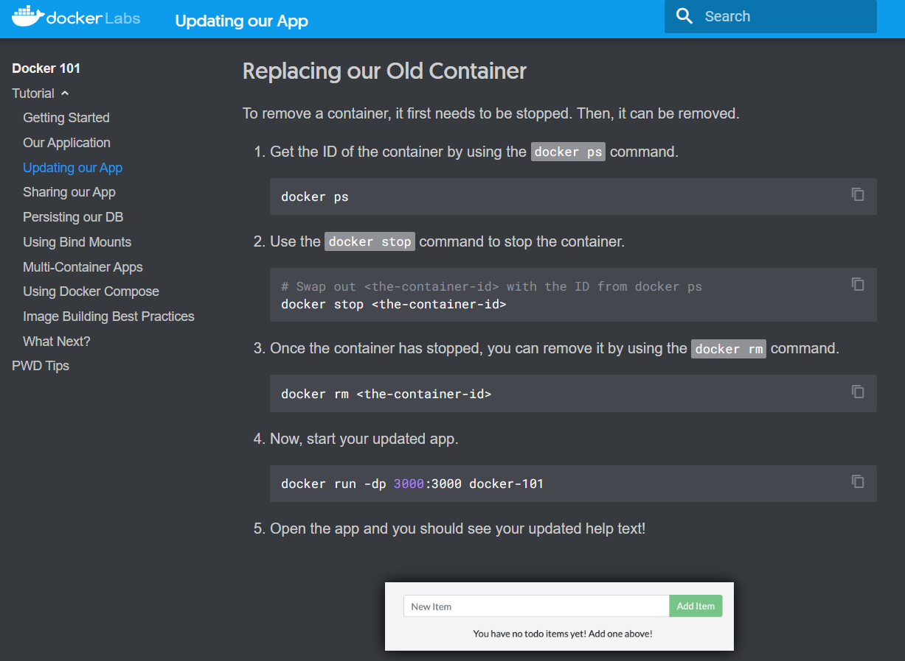
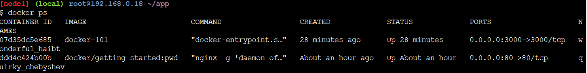
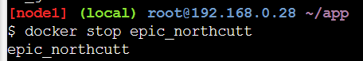

  <h1 style="text-align: center;font-weight: bold">LAPORAN WORKSHOP ADMINISTRASI JARINGAN Tugas 7 : Docker 101 Tutorial - Play Labs</h1>
  <h4 style="text-align: center;">Dosen Pengampu : Dr. Ferry Astika Saputra, S.T., M.Sc.</h4>

 

  
  

    <strong>Bagus Bimo Prakoso (3122500028)</strong> 
  

<h3 style="text-align: center;line-height: 1.5">Politeknik Elektronika Negeri Surabaya Departemen Teknik Informatika Dan Komputer Program Studi Teknik Informatika 2023/2024</h3>

# Getting Started

Buka `https://labs.play-with-docker.com/`

Pastikan sudah sign up atau log in terlebih dahulu

Klik start lalu akan diarahkan di page ini

Lalu klik add New Instance, untuk mulai menjalankan terminal

Lalu masukkan `docker run -dp 80:80 docker/getting-started:pwd` untuk
mencoba run

Lalu masukkan `docker ps -a` untuk mengecek apakah sudah ada

Coba klik 80, lalu akan diarahkan ke hasil container yang telah dirun
sebelumnya

# Our Application

## Getting our App into PWD

Setelah itu coba pergi ke Our Application

Scroll ke bawah, download zip nya untuk contoh project app nya

Download lalu jika sudah, drag and drop ke instance Terminal tadi, lalu
cek apakah sudah berhasil diupload apa belum dengan ls

Jika sudah ada maka lanjutkan sesuai step by stepnya

1.  `unzip app.zip`

2.  Mengecek apakah file sudah terunzip

## Building the App\'s Container Image##

Buat Dockerfile lalu isi dengan content seperti diatas

FROM node:10-alpine

WORKDIR /app

COPY . .

RUN yarn install \--production

CMD \[\"node\", \"/app/src/index.js\"

\]

Lalu build container image `docker build -t docker-101 .`

## Starting an App Container

Coba menjalankan container image yang sudah kita build tadi

`docker run -dp 3000:3000 docker-101`

Lalu klik port 3000 dan akan diarahkan ke container image yang telah di
run

Bisa dilihat bahwa Todo App sudah bisa dibuka, mari kita coba

Berhasil Add

Berhasil hapus

# Updating our App

## Updating our Source Code

Klik editor pada instance

Sesuai dengan arahan dockerLabs pergi ke `app/src/static/js/app.js`

Lalu update line 56

Dan jangan lupa save

Update dengan build kembali `docker build -t docker-101 .`

Start container baru dengan kode yang sudah diupdate

`docker run -dp 3000:3000 docker-101`

Ternyata muncul error sesuai dengan arahan dockerLabs

## Replacing our Old Container

Jalankan `docker ps` untuk melihat container lama yang akan diganti

Stop container lama `docker stop \<container-tujuan\>`, disini nama
dari port 3000 adalah wonderful_haibt

Hapus container yang sudah diberhentikan

`docker rm \<container-tujuan\>`

Run app yang sudah diupdate

Coba refresh page port 3000 tadi

Sudah berhasil terupdate

# Sharing Our App

## Create a Repo

Pergi ke Docker Hub dan login

Lalu Create Repository

Isi nama repository dan visibility public

Lalu klik Create button

## Pushing our Image

Mencoba push

`docker push dockersamples/101-todo-app`

Terdapat error, coba login terlebih dahulu melalui command

Jalankan docker tag

Lalu coba push lagi

## Running our Image on a New Instance

Add new instance pada PWD

Start pada new instance

Coba jalankan port 3000, jika tidak ada link langsung maka klik OPEN
PORT lalu isi 3000

Berhasil di buka, Hooray!

## Persisting our DB

Kembali ke node 1 192.168.0.18

Run docker run -d ubuntu

`docker run -d ubuntu bash -c \"shuf -i 1-10000 -n 1 -o /data.txt && tail -f /dev/null\"`

Run docker exec

Run container ubuntu lain

`docker run -it ubuntu ls /`

Hapus container bash ubuntu

## Persisting our Todo Data

Buat volume

Run todo container, dan stop container 3000 yang masih nyala.

Open container

Remove Container

Start lagi seperti step sebelumnya

Bisa dilihat, list tadi masih ada Hooray!

## Diving into our Volume

# Using Bind Mounts

## Starting a Dev-Mode Container

Stop dulu port 3000 yang masih berjalan

Run command ini

Melihat logs

Buka editor PWD

Update line 109

Jangan lupa save

Tanpa build dan run seperti step sebelumnya, hanya dengan refresh
langsung bisa dilihat updatenya

# Multi-Container Apps

## Starting MySQL

Sebelumnya ctrl+c untuk menghentikan node js

Start MySql

Run exec

Masukan password sesuai setup sebelumnya yaitu secret

## Connect to MySQL

Dari step sebelumnya exit terlebih dahulu dari mysql

## Running our App with MySQL

Karena pada saat step ini saya mengalami error no disk space, maka saya
membuat session baru dan mengulangi dari awal dan mendapatkan ip root
192.168.0.28

Execute melalui container sql

# Using Docker Compose

## Defining the App Service

Stop container port 3000 yang masih berjalan

## Defining the MySQL Service

## Running our Application Stack

Stop port 3000 yang masih berjalan

# Image Building Best Practices

## Image Layering

Karena tadi docker-101 saya hapus maka saya build lagi dan run lagi, dan
jangan lupa stop yang masih jalan :3000

## Layer Caching

Update menjadi seperti ini

Sekarang ubah src/static/index.html title pada line 11, jangan lupa save

Build lagi setelah update

